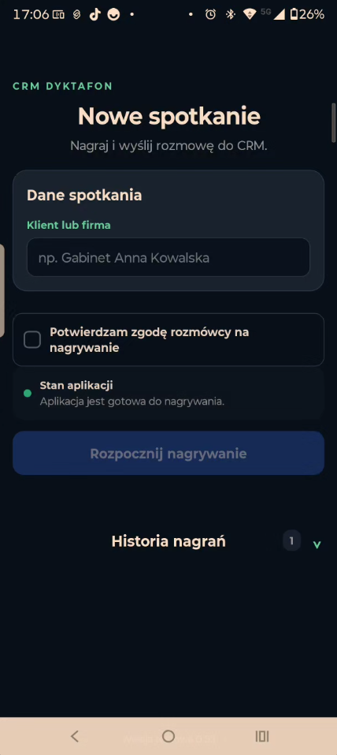
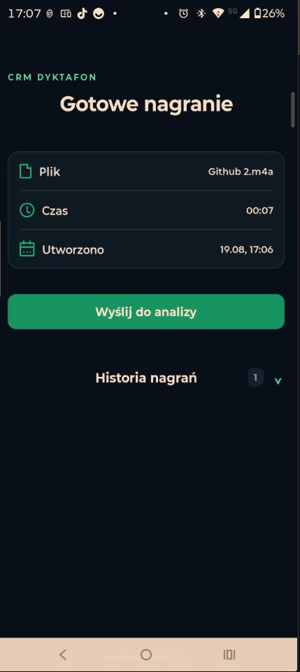
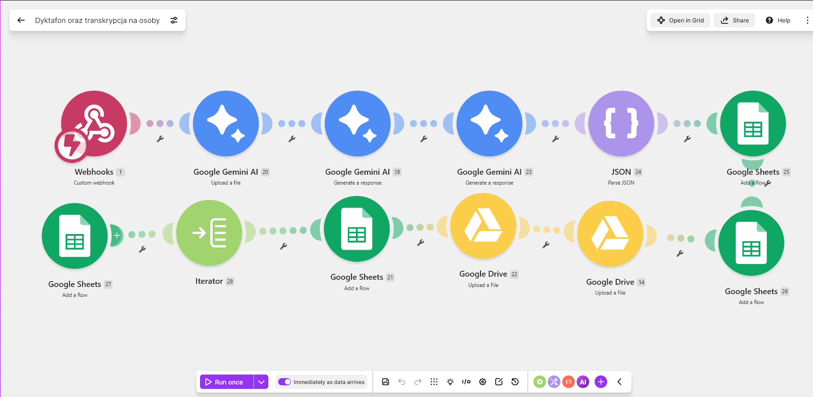

# Dyktafon AI — z rozmowy do ustaleń i terminów

## Po co powstał ten projekt?

Po rozmowie z klientem często zostają notatki na kartce, kilka wiadomości albo zwykłe „trzeba pamiętać”. Łatwo wtedy pominąć ustalenie, zadanie lub termin.

Dyktafon AI analizuje całą nagraną rozmowę i zamienia ją w uporządkowany zapis. Wyszukuje w niej najważniejsze informacje — na przykład wymiary, wybrany materiał, kwoty, terminy, wymagania klienta oraz kolejne zadania — a następnie przygotowuje krótkie podsumowanie i listę spraw do dopilnowania.

To demonstracyjny projekt rozwijany przez Janusza Tracza w ramach projektu MediaWizja. Nie jest gotowym produktem do samodzielnego użycia bez konfiguracji i testów.

## Przykład z życia

Cieśla rozmawia z klientem o zabudowie tarasu. Padają konkretne ustalenia: wymiary, wybrany materiał, termin oględzin i przygotowanie wyceny.

Po rozmowie można wracać do nagrania i szukać informacji od początku. W tym rozwiązaniu z nagrania może powstać czytelna lista:

- jakie są wymiary i zakres prac,
- jaki materiał wybrał klient,
- co zostało ustalone w sprawie wyceny,
- kto ma wykonać dane zadanie,
- do kiedy trzeba wrócić do klienta.

Tak samo rozwiązanie może pomóc w gabinecie, biurze księgowym, firmie budowlanej albo innym zakładzie usługowym — wszędzie tam, gdzie ważne ustalenia zapadają podczas rozmów.

## Jak wygląda to w prostych krokach?

1. Rozmowa zostaje nagrana za zgodą uczestników.
2. System przygotowuje zapis rozmowy.
3. AI analizuje całą treść i wybiera najważniejsze fakty: ustalenia, wymagania, wymiary, materiały, kwoty, zadania i terminy.
4. Wynik trafia do arkusza oraz czytelnego widoku na komputerze, gdzie można go wygodnie sprawdzić.

Nie zastępuje to decyzji człowieka. Wynik trzeba przeczytać i potwierdzić przed wykorzystaniem w pracy.

## Aplikacja na telefonie

### 1. Nowe spotkanie

Przed rozpoczęciem rozmowy użytkownik wpisuje klienta lub firmę i potwierdza zgodę rozmówcy na nagrywanie. Dopiero wtedy można rozpocząć nagranie.



### 2. Gotowe nagranie

Po zakończeniu rozmowy aplikacja pokazuje nazwę pliku, czas nagrania i datę utworzenia. Użytkownik może następnie jednym przyciskiem wysłać nagranie do analizy.



## Co daje firmie?

- mniej spraw, o których można zapomnieć,
- mniej czasu na ręczne przepisywanie ustaleń,
- łatwiejsze pilnowanie terminów,
- prostsze przekazanie sprawy drugiej osobie,
- uporządkowany punkt odniesienia po rozmowie z klientem,
- jedno miejsce do wygodnego śledzenia wielu klientów i spraw.

## Gdy pojawia się więcej klientów

Każda rozmowa może zostać zapisana jako osobna sprawa w arkuszu, a następnie pokazana w czytelnym widoku na komputerze. Dzięki temu właściciel firmy nie musi przeszukiwać wielu nagrań, kartek i wiadomości.

W jednym miejscu może sprawdzić między innymi:

- wszystkie bieżące zlecenia i ich etap,
- uzgodnione wymagania klienta,
- terminy i zadania do wykonania,
- przygotowanie wyceny i rozliczenia,
- sprawy wymagające odpowiedzi e-mail,
- materiały lub usługi, które trzeba zamówić.

To pomaga panować nad codzienną pracą, kiedy rozmów i zleceń jest więcej. Zakres widoku można dopasować do sposobu pracy konkretnej firmy.

## Dla kogo jest ten przykład?

Dla właściciela lub zespołu, który prowadzi rozmowy z klientami i chce lepiej panować nad ustaleniami. Przykładowo: dla małego gabinetu, firmy remontowej, biura rachunkowego, zakładu stolarskiego czy firmy usługowej.

## Ważne zasady prywatności

Rozmowy można nagrywać wyłącznie za wiedzą i zgodą uczestników oraz zgodnie z obowiązującymi zasadami ochrony danych. W publicznym repozytorium nie ma prawdziwych nagrań, transkrypcji ani danych klientów.

## Stan projektu

Projekt jest w trakcie rozwoju i został przetestowany w zakresie nagrywania, przesyłania, tworzenia zapisu rozmowy oraz przygotowywania podsumowań. Przed użyciem w prawdziwej firmie wymaga indywidualnej konfiguracji, testów i sprawdzenia bezpieczeństwa.

---

# Informacje techniczne

Poniższa część jest przeznaczona dla osób, które chcą zobaczyć sposób zbudowania demonstracji.

## Najważniejsze funkcje

- nagrywanie rozmów w aplikacji mobilnej,
- nadawanie nagraniom własnych nazw,
- przechowywanie nagrań w telefonie,
- wysyłanie krótkich nagrań do scenariusza automatyzacji,
- obsługa większych nagrań przez dysk w chmurze,
- transkrypcja nagrania z podziałem na osoby,
- tworzenie podsumowania rozmowy,
- wyodrębnianie ustaleń, zadań i terminów,
- zapis wyników w arkuszu,
- przygotowanie czytelnego widoku HTML.

## Jak działa system

### Krótkie nagrania

1. Użytkownik rozpoczyna i kończy nagrywanie w aplikacji mobilnej.
2. Aplikacja przesyła nagranie do automatyzacji.
3. Automatyzacja przekazuje plik do analizy AI.
4. AI przygotowuje zapis i analizę rozmowy.
5. Wynik jest zapisywany w arkuszu oraz prezentowany w widoku HTML.

### Duże nagrania

1. Nagranie zostaje zapisane na dysku w chmurze.
2. Osobny scenariusz pobiera nowy plik.
3. Plik trafia do analizy AI.
4. AI przygotowuje zapis i analizę rozmowy.
5. Wynik jest zapisywany w arkuszu oraz prezentowany w widoku HTML.

### Schemat krótkiego nagrania

Poniższy schemat pokazuje techniczne zaplecze demonstracji: nagranie trafia do automatyzacji, AI przygotowuje analizę, a wynik zostaje zapisany w arkuszu.



## Zasada ograniczania kosztów

Jedno nagranie powinno powodować jedno wywołanie modelu AI. Odpowiedź zawiera jednocześnie transkrypcję, podsumowanie i pozostałe informacje, dzięki czemu nie trzeba wielokrotnie analizować tego samego pliku.

## Struktura repozytorium

```text
Dyktafon-AI/
├── make/        — oczyszczone scenariusze automatyzacji
├── mobile-app/  — kod aplikacji mobilnej
├── docs/        — materiały pomocnicze
└── README.md
```

Folder `make` zawiera dwa oczyszczone blueprinty scenariuszy: dla nagrań wysyłanych bezpośrednio z aplikacji oraz dla większych nagrań pobieranych z dysku w chmurze.

Folder `mobile-app` zawiera kod aplikacji mobilnej. Publiczna wersja nie zawiera działającego adresu webhooka ani danych dostępowych.

## Wymagane usługi

Do uruchomienia demonstracji potrzebne są:

- Expo Snack lub lokalne środowisko Expo,
- Make,
- Google Gemini API,
- Google Drive,
- Google Sheets,
- telefon z systemem Android lub iOS i aplikacją Expo Go — jeśli projekt jest testowany przez Expo.

## Bezpieczeństwo

W publicznym repozytorium nie wolno umieszczać:

- kluczy API, tokenów i haseł,
- działających adresów webhooków,
- prywatnych identyfikatorów folderów i arkuszy,
- danych logowania,
- prawdziwych nagrań klientów,
- transkrypcji zawierających dane osobowe,
- nieoczyszczonych blueprintów scenariuszy.

Jeżeli działający webhook został wcześniej ujawniony, należy utworzyć nowy adres i wyłączyć poprzedni.

## Plan dalszego rozwoju

- dalsze testy obsługi błędów i ponownej wysyłki,
- przygotowanie bezpiecznych zrzutów ekranu i schematu systemu,
- dalsza optymalizacja kosztów analizy AI.

## Dokumentacja użytych usług

- [Expo](https://docs.expo.dev/)
- [Make — blueprinty scenariuszy](https://help.make.com/blueprints)
- [Google Gemini API](https://ai.google.dev/gemini-api/docs)
- [Google Drive](https://developers.google.com/drive)
- [Google Sheets API](https://developers.google.com/workspace/sheets/api/guides/concepts)
